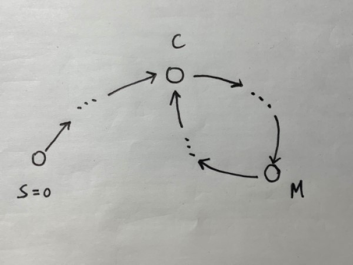
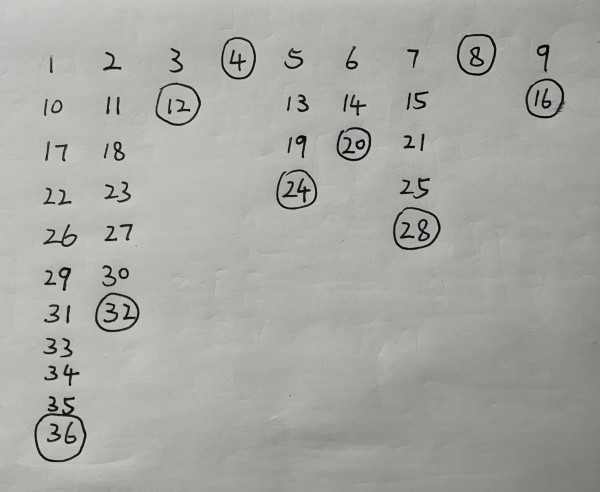
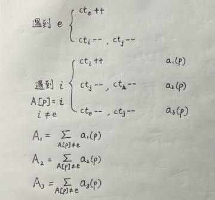
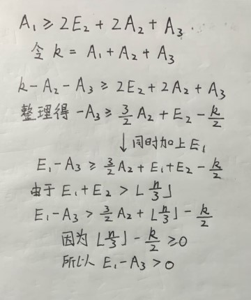
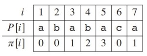
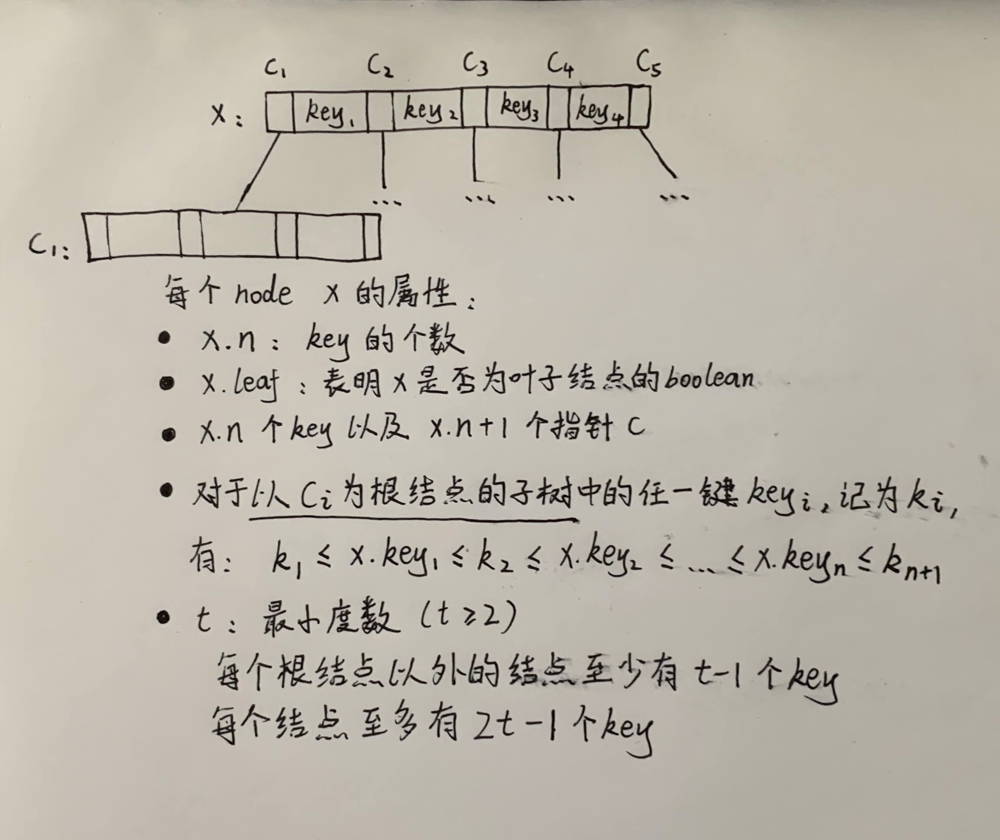

# Algorithms and Data Structures
奇怪的知识增加了！！！
## Table of contents
1. [Selected Topics I(算法问题选编1)](#Chapter1)
    1. [Floyd's Turtoise and Hare(环检测算法)](#Chapter1.1)
    2. [Josephus Problem(约瑟夫环)](#Chapter1.2)
    3. [Fisher-Yates Shuffle(洗牌算法)](#Chapter1.3)
    4. [Boyer-Moore Majority Vote(寻找多数元素)](#Chapter1.4)
2. [KMP(字符串匹配)](#Chapter2)
    1. [Maximum Repetition Factors(最大循环因子/最小循环节)](#Chapter2.1)
    2. [Is T a rotation of S? (判断旋转字符串)](#Chapter2.2)
3. [Greedy(贪心法)](#Chapter3)
    1. [Task Scheduler (LeetCode 621)](#Chapter3.1)
4. [Dynamic Programming(动态规划)](#Chapter4)
    1. [Longest Common Subsequence(最长公共子序列)](#Chapter4.1)
5. [Data Structures(数据结构)](#Chapter5)
    1. [Heap(堆)](#Chapter5.1)
    2. [Red-Black Trees(红黑树)](#Chapter5.2)
    3. [B-Trees(B树)](#Chapter5.3)
    4. [Merge-Find Set(用于不相交集合的并查集)](#Chapter5.4)
6. [Graph(图算法)](#Chapter6)
    1. [Topological Sort(拓扑排序)](#Chapter6.1)
    2. [Strongly Connected Component(强连通分量)](#Chapter6.2)
    3. [Dijkstra's Algorithm(单源最短路径)](#Chapter6.3)
    4. [A* Algorithm(A-star启发式最短路径算法)](#Chapter6.4)
7. [Selected Topics II(算法问题选编2)](#Chapter7)
    1. [Single Number(孤独的数)](#Chapter7.1)
    2. [First Missing Positive(第一个缺失的正整数)](#Chapter7.2)
    3. [Copy List with Random Pointer(拷贝带随机指针的链表)](#Chapter7.3)

<a name="Chapter1"></a>
## Selected Topics I (算法问题选编1)
奇怪的知识增加了！！

<a name="Chapter1.1"></a>
### Floyd's Turtoise and Hare(环检测算法)
先看一道[例题](https://leetcode.com/problems/linked-list-cycle-ii/ "LeetCode 142: Linked List Cycle II")：给定一个链表，返回环的起点；
若没有环，返回null。

这里我们介绍一种算法，可以在有限状态机、迭代函数或者链表上判断是否存在环，并求出该环的起点与长度。

初始状态下，设两个指针t（turtoise，慢指针）和h（hare，快指针），让它们均指向起点S。同时让t和h往前推进，t每次前进1步，h每次前进2步。

当h无法前进，即到达某个没有后继的节点时，就可以确定从S出发不会遇到环。

若t与h再次相遇（在节点M），则可以确定从S出发一定会进入某个环。并且**从S到环的起点的距离**等于**从M到环的起点的距离**。

**算法正确性证明：**

1. 若h推进过程中next为空，则链表无环。这种情况是trivial的。

2. 现在考虑h与t再次相遇在M(M!=S)，这说明链表存在环。我们设S=0，环的起点为C，如下图所示。



假设t推进的次数是s，h的速度是它的两倍，所以推进了2s。h在环上走过的长度为2s-C，t在环上走过的长度为s-C。可以注意到，h在环上走过的长度一定比t在环上走过的长度多出**环的长度的整数倍**，形式化地说，在他们相遇的节点M，存在k，使得2s-C=s-C+kL，其中L是环的长度。

于是，s=kL。M在环上相对于C的偏移为(s-C)%L，也即(kL-C)%L。
这时我们令t从M继续往前推进，令一个新的指针n从S开始推进，当推进C步之后，(kL-C)%L+C=0，也就是说t到达C，而n也到达C，所以他们相遇的地方即为环的起点。

**证毕**

另一道例题：[LeetCode 287: Find the Duplicate Number](https://leetcode.com/problems/find-the-duplicate-number/)

这里有[彩蛋](https://www.youtube.com/watch?v=pKO9UjSeLew)

<a name="Chapter1.2"></a>
### Josephus Problem(约瑟夫环)
n个人围成一个圈，每q个人踢掉一个人，问最后留下来的人是几号？

若使用循环链表模拟计算出结果，则时间复杂度为O(nq)。现在我们尝试用数学进行推导，这将使我们的算法时间复杂度减小。

我们首先考虑一种极端情况，当n趋近于无限时，我们每次踢掉的人的编号是容易计算的，即kq，其中k是一个正整数。这个规律是一个很好的性质。

现在回到n不是无限大的情况。为了使得我们踢掉的人编号依然保留上面的性质，我们可以用如下方法赋予他们新的编号：第一个人编号为1，第二个人编号为2，当我们第一次遇到第q个人时，我们不将它踢出，依然赋予他编号q。所有n个人被赋予编号后，我们回到第一个人（因为他们围成一个圈），由于编号继续自增，所以他的编号从1变成n+1。然后我们会遇到编号为q的人，这是我们第二次遇到他，我们将他踢出，不再赋予他新的编号。同理，若遇到一个编号为kq的人，我们将他踢出，不再赋予他新的编号。对于n=9，q=4的编号方式如下图所示。



对于这种编号方式，需要注意几个点。首先，第一排的编号，就是这n个人原始的编号。另一方面，我们踢出人的顺序，是与题目保持一致的。最后一点，当我们踢掉一个编号为kq的人后，我们总共踢掉了k个人，因此可以判断最后剩下的人的最后一个编号为nq。现在，我们需要一种方式，找到最后编号为nq的人，原始编号是多少。

现在考虑编号为kq的人，当我们为他打上kq的编号时，他还没有被踢掉。位于他后面k(1<=k<q)位的玩家，在那一轮被编号为kq+d。现在，我们的当前编号从kq+d开始自增。当遇到一个编号为q的倍数的玩家时，我们把它踢掉并且不增加当前编号；之前被踢掉的玩家也会被无视掉。因此，当我们再次遇到kq+d，**当前编号增加的量**为n-k，也即**仍留在循环链表当中的玩家数量**。编号kq+d将变成k(q-1)+n+d。

所以，若已知一个玩家目前的编号，就可以推出他上一轮的编号。N=N-n+k，其中k=(N-n-d)/(q-1)。注意这里N-n-d能被q-1整除，又因为1<=k<q，所以有：

k=(N-n-d)/(q-1)=floor((N-n-1)/(q-1))

```cpp
int Josephus(int n, int q) {
    int N = n * q;
    while (N > n) {
        int k = (N-n-1) / (q-1);
        N = N - n + k;
    }
    return N;
}
```

**时间复杂度分析：**
首先对N进行换元，设N=qn+1-x，N从nq开始减小，直到N<=n。于是x从1开始增大，直到x>=(q-1)n+1。则x在每次迭代中的递推式为x=ceiling((qx)/(q-1))，因此迭代次数t不超过log<sub>q/(q-1)</sub>((q-1)n))=log<sub>q/(q-1)</sub>n+C，其中C=log<sub>q/(q-1)</sub>(q-1)，因此算法运行时间为O(log(n))。

<a name="Chapter1.3"></a>
### Fisher-Yates Shuffle(洗牌算法)
给定一个长度为n的数组，随机返回一个该数组的排列，每种排列被返回的概率为1/n!。

洗牌算法的思路很简单，从最后一个位置n-1循环至位置0，对于每一个位置i，随机选取\[0,n-1]区间上的一个位置j，交换i和j两个位置的值。

```cpp
void shuffle(vector<int> &A) {
    std::default_random_engine generator;
    for (int i = A.size() - 1; i >= 0; i--) {
        std::uniform_int_distribution<int> distribution(0, i);
        int j = distribution(generator);
        int temp = A[i];
        A[i] = A[j];
        A[j] = temp;
    }
}
```
可以证明，对于原数组中任何一个数，洗牌后它出现在位置i的概率为1/n。

<a name="Chapter1.4"></a>
### Boyer-Moore Majority Vote(寻找多数元素)
[例题](https://leetcode.com/problems/majority-element-ii/ "LeetCode 229: Majority Element II")：给定一个长度为n的int数组，找到所有出现超过⌊ n/3 ⌋次的元素。

对于此题，不难分析，majority element的个数至多2个，否则总共的元素个数将超过n个。Boyer-Moore Majority Vote算法的思想如下：

在第一个pass中，我们遇到了元素e。如果e已经是candidate，那么将该candidate的计数值加1；若e不等于任何一个candidate，那么将所有candidate的计数值减1；若e不等于任何一个candidate，且某个candidate的计数值已经为0，那么将此candidate替换为e，并且使它的计数值为1。在第二个pass中，我们去验证所有的candidate出现的次数是否严格大于⌊ n/3 ⌋。代码如下。

```cpp
vector<int> majorityElement(vector<int>& nums) {
    int ct1 = 0, ct2 = 0;
    int v1 = -1, v2 = -1;
    // First pass: find candidates
    for (int i = 0; i < nums.size(); i++) {
        if (v1 == nums[i]) {
            ct1++;
        }
        else if (v2 == nums[i]) {
            ct2++;
        }
        else if (ct1 == 0) {
            ct1++;
            v1 = nums[i];
        }
        else if (ct2 == 0) {
            ct2++;
            v2 = nums[i];
        }
        else {
            ct1--;
            ct2--;
        }
    }
    // Second pass: validate candidates
    ct1 = 0;
    ct2 = 0;
    for (int i = 0; i < nums.size(); i++) {
        if (nums[i] == v1) {
            ct1++;
        }
        else if (nums[i] == v2) {
            ct2++;
        }
    }
    vector<int> result;
    if (ct1 > nums.size() / 3) {
        result.push_back(v1);
    }
    if (ct2 > nums.size() / 3) {
        result.push_back(v2);
    }
    return result;
}
```

**算法正确性证明：**
证明的关键是要证明：多数元素一定会留在candidate中。我们的证明方法类似于聚合分析，聚合分析的详细介绍请参考CLRS。

对于一个多数元素e，我们将它的计数值表示为ct<sub>e</sub>。类似地，对于其他元素i (i != e)，计数值表示为ct<sub>i</sub>。

当我们遇到e时，会有两种可能的行为：1.使ct<sub>e</sub>增加1； 2.使两个其他candidate的ct<sub>i</sub>和ct<sub>j</sub>减1(其中i, j, e互不相等)。

当我们遇到i时(i != e)，有三种可能的行为：1.使ct<sub>i</sub>增加1；2.使ct<sub>j</sub>和ct<sub>k</sub>减1(其中i, j, k互不相等)；3.使ct<sub>e</sub>和ct<sub>j</sub>减1(其中i, j, k互不相等)。

我们将**遇到e时行为1发生的次数**记为E<sub>1</sub>，将**遇到e时行为2发生的次数**记为E<sub>2</sub>。不难发现，两种行为发生的总次数即为数组中e的个数。由于e的个数严格大于⌊ n/3 ⌋，我们可以得到E<sub>1</sub>+E<sub>2</sub> > ⌊ n/3 ⌋。

对于遇到i (i != e)的情况下的三个行为，我们采用更形式化的描述。我们在数组A的位置p遇到元素i (i != e)，函数a<sub>1</sub>(p)=1当且仅当在位置p发生行为1，函数a<sub>2</sub>(p)=1当且仅当在位置p发生行为2，函数a<sub>3</sub>(p)=1当且仅当在位置p发生行为3。我们关心的是每种行为发生的总的次数，因此我们对三个函数的值求和，并分别记为A<sub>1</sub>, A<sub>2</sub>, A<sub>3</sub>，如下图所示。



注意到，A<sub>1</sub>+A<sub>2</sub>+A<sub>3</sub>=n-(E<sub>1</sub>+E<sub>2</sub>)。元素e最终仍然是candidate的条件是它的计数值大于0，而它最终的计数值可按此计算：E<sub>1</sub>-A<sub>3</sub>，所以我们只需要证明E<sub>1</sub>-A<sub>3</sub> > 0即可。

在遇到e时发生行为2的次数达到E<sub>2</sub>的前提是，行为a<sub>1</sub>至少发生了2E<sub>2</sub>次，使得我们遇到e时有有足够的计数值被减掉。同理，行为a<sub>2</sub>和行为a<sub>3</sub>也会消耗不等于e的元素的计数值。因此我们有A<sub>1</sub> >= 2E<sub>2</sub>+2A<sub>2</sub>+A<sub>3</sub>. 下图包含了余下的证明过程。



**证毕**

<a name="Chapter2"></a>
## KMP(字符串匹配)
KMP算法用于字符串匹配，时间复杂度为O(n+m)。CLRS对于该算法有比较好的解读，这里只摘取一些核心内容。

已知一个模式P\[1..m]，模式P的前缀函数是函数π: {1, 2, ..., m} → {0, 1, ..., m-1}，满足:

π\[q] = max{k: k<q 且 P<sub>k</sub>是P<sub>q</sub>的后缀}，其中P<sub>x</sub>表示P的前x个字符组成的substring。

例如，模式ababaca的前缀函数为：



利用该函数，我们可以在O(n)时间内完成文本T和模式P的匹配。注意，以下实现中，我们的字符串以索引0开始，需要对上述定义稍加修改，但本质是一样的。

```cpp
void KMP_matcher(string T, string P) {
    int n = T.length();
    int m = P.length();
    vector<int> next = compute_prefix_function(P);
    int q = -1; // end index of the pattern matched 
    for (int i = 0; i < n; i++) { // scan the text from left to right
        while (q > -1 && P[q + 1] != T[i]) {
            q = next[q]; // next character does not match
        }
        if (P[q + 1] == T[i]) {
            q++; // next character matches
        }
        if (q == m - 1) { // is all of P matched?
            cout << "Pattern occurs with shift " << i - m + 1 << endl;
            q = next[q]; // look for the next match
        }
    }
}

vector<int> compute_prefix_function(string P) {
    int m = P.length();
    vector<int> next(m);
    next[0] = -1;
    int k = -1;
    for (int q = 1; q < m; q++) {
        while (k > -1 && P[k + 1] != P[q]) {
            k = next[k];
        }
        if (P[k + 1] == P[q]) {
            k++;
        }
        next[q] = k;
    }
    return next;
}
```

我们用compute_prefix_function计算模式P的前缀函数（记为next），该函数的结构和KMP算法的主体非常相似，它实际上相当于模式P与自身的匹配，并且时间复杂度为O(m)。细心推敲可以发现，计算过程运用了动态规划的思想，next数组保存了到位置q为止，能成为P<sub>q</sub>的后缀的最大真前缀长度。

**注：** 很多教材将前缀函数π记为next，我们遵从这样的命名习惯。但是，next这个词本身容易产生歧义，或者说需要额外的解释说明。

<a name="Chapter2.1"></a>
### Maximum Repetition Factors(最大循环因子/最小循环节)
解决下面的问题是KMP算法的一个经典应用场合：

设y<sup>i</sup>表示字符串y与其自身首尾相接i次所得的结果。例如(ab)<sup>3</sup> = ababab。如果对某个字符串y和某个r>0有x=y<sup>r</sup>，则称字符串x具有重复因子r，y称为x的循环节。给定一个字符串S，找到它具有的重复因子的最大值，或者等价的，找到它具有的最小循环节。

例子：ababab的最大循环因子为3，最小循环节为ab；abac的最大循环因子为1，最小循环节为它本身。

KMP算法的前缀函数π，能帮助我们解决这个问题。对于字符串S\[1...n]，考虑这种情况：n % (n-π\[n]) == 0。根据前缀函数的性质，S的前π\[n]个字符是S的后缀。设t = π\[n]，则有S\[1...t] == S\[(n-t+1)...n]。

因此，S\[1...(n-t)] = S\[(n-t+1)...(2n-2t)] = S\[(2n-2t+1)...(3n-3t)] = ... = S\[(t+1)...n]，前n-t个字符组成字符串S的一个最小循环节。

如果n % (n-π\[n]) != 0，那么可以看作字符串S缺失了一部分字符，来组成S\[1...t]的幂，因此最小循环节就是它本身。例如：abcabcab，n = 8, n - t = 3。

<a name="Chapter2.2"></a>
### Is T a rotation of S? (判断旋转字符串)
KMP算法的另一典型用例是判断两个字符串是否能通过**旋转操作**进行转换。

S的旋转定义为：令S的全体字符向左（或右）移动k (0 <= k < S.length())次，溢出的字符接在另一侧的后面。例如：cdab是abcd的一个旋转。给定两个字符串T和S，判断T是否为S的旋转。

我们可以将两个T拼接起来得到一个新的字符串T<sup>2</sup>，然后在T<sup>2</sup>中查找模式S。如果匹配成功则说明T是S的旋转。

<a name="Chapter3"></a>
## Greedy(贪心法)
CLRS中对贪心法的描述为：在每个决策点，它做出在当时看来最佳的选择。这种启发式策略并不保证总能找到最优解，但对有些问题确实有效。

<a name="Chapter3.1"></a>
### Task Scheduler ([LeetCode 621](https://leetcode.com/problems/task-scheduler/))
[这里](https://leetcode.com/problems/task-scheduler/discuss/104500/Java-O(n)-time-O(1)-space-1-pass-no-sorting-solution-with-detailed-explanation)有一个对该问题非常细致的解读。我们对其核心思想进行一些说明。

假如我们的任务列表为{A, A, A, B, B, C}，冷却时间n = 2，直观上来看，我们的调度方案应该是A B C A B idle A。A出现的次数最多，所以无论如何，我们要将所有的A尽可能最密集地排开，也就得到了A slot slot A slot slot A，其中slot表示可以放入任务的一个槽。

我们将其余的任务填在这些slot中，得到结果A B C A B idle A。idle的数量事实上就等于空的槽的数量减去剩余的任务数量。

如果空的槽的个数不足以使我们放入所有的剩余任务，这种情况其实是一个更宽松的条件。例如任务列表为{A, A, A, B, B, C, C, D, D}，冷却时间为2，我们在放完C之后发现没有slot可以放了：A B C A B C A。但其实我们加大两个A之间的间隔就好了：A B C D A B C D A。这样一来D也能放进去，并且所有相同任务之间的间隔依然满足要求。这种情况下，我们并不需要设置idle。

另外考虑出现次数最多的任务不唯一的情况，例如{A, A, B, B, C, D}, n = 2。这时我们用所有出现次数最多的任务来确定slot：A B slot A B。

代码如下。

```cpp
int leastInterval(vector<char>& tasks, int n) {
    vector<int> freq(26, 0);        
    for (int i = 0; i < tasks.size(); i++) {
        freq[tasks[i] - 'A']++;
    }
    int maxFreq = 0;
    int maxFreqCt = 1;
    for (int i = 0; i < freq.size(); i++) {
        if (freq[i] > maxFreq) {
            maxFreq = freq[i];
            maxFreqCt = 1;
        }
        else if (freq[i] == maxFreq) {
            maxFreqCt++;
        }
    }
    int emptySlots = (n - maxFreqCt + 1) * (maxFreq - 1);
    int remainingTasks = tasks.size() - maxFreqCt * maxFreq;
    int idle = max(0, emptySlots - remainingTasks);
    return tasks.size() + idle;
}
```

<a name="Chapter4"></a>
## Dynamic Programming(动态规划)
动态规划通过**备忘录**或者**自下而上**的方式，避免重复求解子问题。可以参考CLRS了解两种方式的更多细节。

很多动态规划问题可以建构为对2维dp数组的填充。典型的例如Longest Common Subsequence问题，我们可以从**邻近的**规模更小的子问题中得出当前问题的解。有一些题目，例如[LeetCode 62: Unique Paths](https://leetcode.com/problems/unique-paths/)，有着更为明显的几何含义。而对于像[LeetCode 174: Dungeon Game](https://leetcode.com/problems/dungeon-game/)这样的题目，我们构建dp数组的方向还会影响算法的可行性。

<a name="Chapter4.1"></a>
### Longest Common Subsequence(最长公共子序列)
题目描述：[LeetCode 1143](https://leetcode.com/problems/longest-common-subsequence/)

字符串S的子序列定义为：从S中剔除一些字符（可以不剔除）后剩下的字符串（保留原始相对位置）。

这里dp的递推式体现在下面代码的if-else条件中。

```cpp
int longestCommonSubsequence(string text1, string text2) {
    vector<vector<int>> dp(text1.size() + 1, vector<int>(text2.size() + 1, 0));
    for (int i = 0 ; i < text1.size(); i++) {
        for (int j = 0; j < text2.size(); j++) {
            if (text1[i] == text2[j])
                dp[i + 1][j + 1] = dp[i][j] + 1;
            else {
                dp[i + 1][j + 1] = max(dp[i][j + 1], dp[i + 1][j]);
            }
        }
    }
    return dp[text1.size()][text2.size()];
}
```

<a name="Chapter5"></a>
## Data Structures(数据结构)
奇怪的知识持续增加。

<a name="Chapter5.1"></a>
### Heap(堆)
堆这种数据结构拥有很重要的性质，它可以替我们方便地维护可比较的层级结构，用于**排序**或者**优先队列**。CLRS中对堆数据结构有详尽的说明。

1. 对于一个数组A，我们将其看作一个堆，那么对于下标i，我们可以计算它的父结点、左孩子、右孩子的下标：

    PARENT(i) = ⌊ (i-1)/2 ⌋, LEFT(i) = 2i+1, RIGHT(i) = 2i+2.

2. **MAX_HEAPIFY**用于维护最大堆的性质。在调用时，我们假定根结点为LEFT(i)和RIGHT(i)的二叉树都是最大堆，但这时A\[i]有可能小于其孩子。MAX_HEAPIFY让A\[i]的值在最大堆中“逐级下降”，以维护最大堆的性质。

```cpp
void MAX_HEAPIFY(vector<int> &A, int i, int heapSize) {
    int l = LEFT(i);
    int r = RIGHT(i);
    int largest;
    if (l < heapSize && A[l] > A[i]) {
        largest = l;
    }
    else {
        largest = i;
    }
    if (r < heapSize && A[r] > A[largest]) {
        largest = r;
    }
    if (largest != i) {
        int temp = A[i];
        A[i] = A[largest];
        A[largest] = temp;
        MAX_HEAPIFY(A, largest, heapSize);
    }
}
```

3. **建堆**

```cpp
void BUILD_MAX_HEAP(vector<int> &A) {
    for (int i = A.size() / 2 - 1; i >= 0; i--) {
        MAX_HEAPIFY(A, i, A.size());
    }
}
```

4. **堆排序算法**

```cpp
void HEAPSORT(vector<int> &A) {
    BUILD_MAX_HEAP(A);
    int heapSize = A.size();
    for (int i = A.size() - 1; i >= 0; i--) {
        int temp = A[0];
        A[0] = A[i];
        A[i] = temp;
        heapSize--;
        MAX_HEAPIFY(A, 0, heapSize);
    }
}
```

5. **优先队列**

    一个**最大优先队列**支持以下操作：

    INSERT(S, x)：把元素x插入集合S中。

    MAXIMUM(S)：返回S中具有最大键字的元素。

    EXTRACT_MAX(S)：去掉并返回S中的具有最大键字的元素。

    INCREASE_KEY(S, x, k)：将元素x的关键字值增加到k，这里假设k的值不小于x的原关键字值。

```cpp
int HEAP_MAXIMUM(const vector<int> &A) {
    return A[0];
}

int HEAP_EXTRACT_MAX(vector<int> &A, int &heapSize) {
    if (heapSize < 1) {
        cout << "heap underflow" << endl;
    }
    int max = A[0];
    A[0] = A[heapSize - 1];
    heapSize--;
    MAX_HEAPIFY(A, 0, heapSize);
    return max;
}

void HEAP_INCREASE_KEY(vector<int> &A, int i, int key) {
    if (key < A[i]) {
        cout << "new key is smaller than current key" << endl;
    }
    A[i] = key;
    while (i > 0 && A[PARENT(i)] < A[i]) {
        int temp = A[i];
        A[i] = A[PARENT(i)];
        A[PARENT(i)] = temp;
        i = PARENT(i);
    }
}

void MAX_HEAP_INSERT(vector<int> &A, int key, int &heapSize) {
    heapSize++;
    A.push_back(INT_MIN);
    HEAP_INCREASE_KEY(A, heapSize - 1, key);
}
```

后续我们将看到，优先队列可以用于Dijkstra算法和A\*算法。

<a name="Chapter5.2"></a>
### Red-Black Trees(红黑树)
红黑树是一种平衡的二叉搜索树，它的高度不超过2lg(n+1)。CLRS中对红黑树有详尽的说明，这里我们只介绍它的性质。

一棵红黑树是满足下面**红黑性质**的二叉搜索树：
1. 每个结点或是红色的，或是黑色的。
2. 根结点是黑色的。
3. 每个叶结点(NULL)是黑色的。（我们将NULL当成一个哨兵，将它看作树的叶结点）
4. 如果一个结点是红色的，则它的两个子结点都是黑色的。
5. 对每个结点，从该结点到其所有后代叶结点的简单路径上，均包含相同数目的黑色结点。

从某个结点x出发（不含该结点）到达一个叶结点的任意一条简单路径上的黑色结点个数称为该结点的**黑高**(black-height)，记为bh(x)。

一棵有n个内部结点的红黑树的高度至多为2lg(n+1)。

**证明**

先证明以任一结点x为根的子树中至少包含2<sup>bh(x)</sup>-1个内部结点。对x的高度进行归纳可以得证。

根据性质4，从根到叶结点（不包含根结点）的任何一条简单路径上都至少有一半的结点为黑色。因此根的黑高至少为h/2，于是n >= 2<sup>h/2</sup> - 1，得到h <= 2lg(n+1)。

**证毕**

该性质说明了为什么红黑树是一种好的搜索树。事实上，在树上的**插入**和**删除**操作，都可以在O(h)时间内完成，即在O(lg*n*)时间内完成。这两个操作请参考CLRS。

<a name="Chapter5.3"></a>
### B-Trees(B树)
B树是一种用以降低磁盘I/O操作数的数据结构，许多数据库系统也使用B树来存储信息。

机械硬盘通过**磁头**来读写数据，我们的I/O延迟来自于**寻道时间**和**旋转延迟**。为了摊还机械移动所花费的等待时间，磁盘会一次存取多个数据项而不是一个。信息被分成**页面**（page），每次磁盘读写一个或多个页面，一个页面一般为2<sup>11</sup>~2<sup>14</sup>字节。

B树的一个结点，就可以是一个页面大小。我们的算法在引用每个结点时，都保证之前已经从磁盘获取了该结点。B树的定义如下：



**B树上的插入**

假设我们已经走到叶结点，但是该叶结点已满，插入操作将使key的个数超过2t-1个。自然地，我们可以将该叶结点分裂为两个叶结点；相应地，在父结点，我们需要增加一个key和一个c指针以支持我们新增的子节点。这样的操作逻辑需要我们在B树上向上“回溯”，因而需要两个pass。但事实上，我们可以在一个pass内做完这件事情。

首先，在向下遇到每个结点时，我们假设算法可以保证该结点没有满。然后，我们查找它的子结点，若待插入的子结点满了，我们需要将它split。split会为当前结点引入新的key和孩子指针，但是我们已经保证了该当前结点未满，所以是合理的。因而插入操作可以从上到下一个pass完成。

**B树上的删除**

假设我们要删除一个中间结点的key，我们找到key的前驱或者后继所在的结点，如果这两个结点之中任意一个的key的数量大于t-1，那么我们将key的值设为该前驱/后继，然后我们在那个结点中递归地删去前驱/后继。若前驱或者后继所在的结点的key的数量都为t-1，那么合并这两个结点，删去key。

假设我们从叶结点删除一个key之后，key的数量少于t-1，我们自然希望对其进行补充。如果它相邻的两个兄弟结点中有一个的key大于t-1，则向其借一个key。若没有这样的兄弟，那么与一个兄弟进行合并。

插入和删除操作都可以在O(lg*n*)时间内完成，更详细的说明请参考CLRS。

**为什么数据库系统多采用B树而不是Hash表？**

1. Hash表只定义了equal函数，它适合用于元素的存在性判断，但是不能对值进行比较，也就是没有一个强排序关系（例如“<”）。相反，基于树的查询结构则定义了key上的less than函数。

2. 我们可以用B树的变种，B+树，它的区别在于我们只将卫星数据存放在叶结点。我们在每个叶结点上可以定义指向后继叶结点的指针，因而在形如“找到所有年龄大于42岁的雇员”的查询中，B树更为高效，而Hash表则需要对所有42岁以上的年龄进行查询。（假设我们针对年龄建立了索引）

3. 

<a name="Chapter5.4"></a>
### Merge-Find Set(用于不相交集合的并查集)

这里摘录一个启发式的并查集设计，在这种**带路径压缩和按秩合并**的并查集上，每一个操作的摊还代价为O(α(n))，其中n是MAKE_SET操作的个数，α(n)是一个增长非常慢的函数，在任何一个我们可以想象的应用中，都有α(n) <= 4。证明详见CLRS。

```cpp
class Node {
public:
    Node *p;
    int rank;
};

void MAKE_SET(Node *x) {
    x->p = x;
    x->rank = 0;
}

void UNION(Node *x, Node *y) {
    LINK(FIND_SET(x), FIND_SET(y));
}

void LINK(Node *x, Node *y) {
    if (x->rank > y->rank) {
        y->p = x;
    }
    else {
        x->p = y;
        if (x->rank == y->rank) {
            y->rank++;
        }
    }
}

Node* FIND_SET(Node *x) {
    if (x != x->p) {
        x->p = FIND_SET(x->p);
    }
    return x->p;
}

```

<a name="Chapter6"></a>
## Graph(图算法)

<a name="Chapter6.1"></a>
### Topological Sort(拓扑排序)
用DFS

或者，Kahn's algorithm：

L ← Empty list that will contain the sorted elements
S ← Set of all nodes with no incoming edge

while S is not empty do
    remove a node n from S
    add n to tail of L
    for each node m with an edge e from n to m do
        remove edge e from the graph
        if m has no other incoming edges then
            insert m into S

if graph has edges then
    return error (graph has at least one cycle)
else 
    return L (a topologically sorted order)


<a name="Chapter7"></a>
## Selected Topics II (算法问题选编2)
奇怪的知识二次增加！

<a name="Chapter7.1"></a>
### Single Number(孤独的数)

[例1](https://leetcode.com/problems/single-number/)：给定一个数组A，除一个元素仅出现一次外，其他元素均出现2次。找到这个只出现一次的元素。

一个O(n)复杂度的算法利用了异或^操作。

```cpp
int singleNumber(vector<int>& nums) {
    int result = 0;
    for (int i = 0; i < nums.size(); i++) {
        result = result ^ nums[i];
    }
    return result;
}
```

我们注意到，异或操作有一个性质，它可以在结果中保存一个状态。当两个相同的数进行异或操作时得到0，而0与任何数x进行异或操作会得到x本身。进一步思考可以发现，异或操作相当于按位加的一个运算：0^1 = 1^0 = 1, 0^0 = 0。而1^1 = 0是因为溢出。

如果把程序中result每一位都看作一个计数器，那么对于任何一个出现两次的数x，它对任何一位都会贡献2次。计数为偶数的位，会为0，留下的计数为奇数的位，跟只出现一次的数一样。

[例2](https://leetcode.com/problems/single-number-ii/)：给定一个数组A，除一个元素仅出现一次外，其他元素均出现3次。找到这个只出现一次的元素。

由于二进制本身2溢出的性质，我们不能只利用一个int变量来保存计数值了。但是我们可以人为地对计数器进行扩展：我们允许的计数值为0,1,2，并且计数值达到3时溢出为0。程序如下所示。

```cpp
int singleNumber(vector<int>& nums) {
    int one = 0;
    int two = 0;
    for (int i = 0; i < nums.size(); i++) {
        one = (one ^ nums[i]) & (~two);
        two = (two ^ nums[i]) & (~one);
    }
    return one;
}
```

程序中one是计数器的低位，two是计数器的高位。为了更新计数器低位，我们将它和nums\[i]进行异或，得到按位的和，如果这时高位为0，则计数器低位被置为异或的结果；否则，我们始终设低位为0，因为达到3时计数器溢出。同理，我们可以更新高位。为了便于理解，我们还可以画出一个有限状态机，每个跳转以数组当前的值nums\[i]为输入。

由于出现3次的数在每一位上贡献的计数值会溢出掉，留下的值即为仅出现一次的数。举一反三，我们还可以解类似的题目，除了孤独的数，其他数出现4次、5次或者更多。

这种**按位计数**的思想可以运用在很多编程题目中。

<a name="Chapter7.2"></a>
### First Missing Positive(第一个缺失的正整数)

**在这一节和下一节，我希望分享两道可以in-place完成的算法题目。解析请自行查阅。**

题目链接：[LeetCode 41: First Missing Positive](https://leetcode.com/problems/first-missing-positive/)

<a name="Chapter7.3"></a>
### Copy List with Random Pointer(拷贝带随机指针的链表)

题目链接：[LeetCode 138: Copy List with Random Pointer](https://leetcode.com/problems/copy-list-with-random-pointer/)

与前一题类似，这道题看似是不可能完成的，但是我们依然有in-place的方法。
