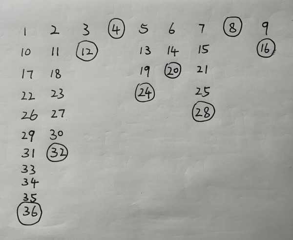

# Algorithms and Data Structures
奇怪的知识增加了！！！
## Table of contents
1. [Floyd's Turtoise and Hare(环检测算法)](#Chapter1)
2. [Josephus Problem(约瑟夫环)](#Chapter2)
3. [Fisher-Yates Shuffle(洗牌算法)](#Chapter3)
4. [Boyer-Moore Majority Vote(寻找多数元素)](#Chapter4)
5. [KMP(字符串匹配)](#Chapter5)
    1. [Maximum Repetition Factors(最大循环因子/最小循环节)](#Chapter5.1)
    2. [Is T a rotation of S?(判断旋转字符串)](#Chapter5.2)
6. [Greedy(贪心法)](#Chapter6)
    1. [Task Scheduler (LeetCode 621)](#Chapter6.1)
7. [Dynamic Programming(动态规划)](#Chapter7)
    1. [Longest Common Subsequence(最长公共子序列)](#Chapter7.1)
8. [Data Structures(数据结构)](#Chapter8)
    1. [Heap(堆)](#Chapter8.1)
    2. [Red-Black Trees(红黑树)](#Chapter8.2)
    3. [B-Trees(B树)](#Chapter8.3)
    4. [Merge-Find Set(用于不相交集合的并查集)](#Chapter8.4)
9. [Graph(图算法)](#Chapter9)
    1. [Topolocial Sort(拓扑排序)](#Chapter9.1)
    2. [Strongly Connected Component(强连通分量)](#Chapter9.2)
    3. [Dijkstra's Algorithm(单源最短路径)](#Chapter9.3)
    4. [A* Algorithm(A-star启发式最短路径算法)](#Chapter9.4)

<a name="Chapter1"></a>
## Floyd's Turtoise and Hare(环检测算法)
先看一道[例题](https://leetcode.com/problems/linked-list-cycle-ii/ "LeetCode 142: Linked List Cycle II")：给定一个链表，返回环的起点；
若没有环，返回null。

这里我们介绍一种算法，可以在有限状态机、迭代函数或者链表上判断是否存在环，并求出该环的起点与长度。

初始状态下，设两个指针t（turtoise，慢指针）和h（hare，快指针），让它们均指向起点S。同时让t和h往前推进，t每次前进1步，h每次前进2步。

当h无法前进，即到达某个没有后继的节点时，就可以确定从S出发不会遇到环。

若t与h再次相遇（在节点M），则可以确定从S出发一定会进入某个环。并且**从S到环的起点的距离**等于**从M到环的起点的距离**。

**算法正确性证明：**

1. 若h推进过程中next为空，则链表无环。这种情况是trivial的。

2. 现在考虑h与t再次相遇在M(M!=S)，这说明链表存在环。我们设S=0，环的起点为C，如下图所示。


假设t推进的次数是s，h的速度是它的两倍，所以推进了2s。h在环上走过的长度为2s-C，t在环上走过的长度为s-C。可以注意到，h在环上走过的长度一定比t在环上走过的长度多出**环的长度的整数倍**，形式化地说，在他们相遇的节点M，存在k，使得2s-C=s-C+kL，其中L是环的长度。

于是，s=kL。M在环上相对于C的偏移为(s-C)%L，也即(kL-C)%L。
这时我们令t从M继续往前推进，令一个新的指针n从S开始推进，当推进C步之后，(kL-C)%L+C=0，也就是说t到达C，而n也到达C，所以他们相遇的地方即为环的起点。

**证毕**

另一道例题：[LeetCode 287: Find the Duplicate Number](https://leetcode.com/problems/find-the-duplicate-number/)

<a name="Chapter2"></a>
## Josephus Problem(约瑟夫环)
n个人围成一个圈，每q个人踢掉一个人，问最后留下来的人是几号？

若使用循环链表模拟计算出结果，则时间复杂度为O(nq)。现在我们尝试用数学进行推导，这将使我们的算法时间复杂度减小。

我们首先考虑一种极端情况，当n趋近于无限时，我们每次踢掉的人的编号是容易计算的，即kq，其中k是一个正整数。这个规律是一个很好的性质。

现在回到n不是无限大的情况。为了使得我们踢掉的人编号依然保留上面的性质，我们可以用如下方法赋予他们新的编号：第一个人编号为1，第二个人编号为2，当我们第一次遇到第q个人时，我们不将它踢出，依然赋予他编号q。所有n个人被赋予编号后，我们回到第一个人（因为他们围成一个圈），由于编号继续自增，所以他的编号从1变成n+1。然后我们会遇到编号为q的人，这是我们第二次遇到他，我们将他踢出，不再赋予他新的编号。同理，若遇到一个编号为kq的人，我们将他踢出，不再赋予他新的编号。对于n=9，q=4的编号方式如下图所示。



对于这种编号方式，需要注意几个点。首先，第一排的编号，就是这n个人原始的编号。另一方面，我们踢出人的顺序，是与题目保持一致的。最后一点，当我们踢掉一个编号为kq的人后，我们总共踢掉了k个人，因此可以判断最后剩下的人的最后一个编号为nq。现在，我们需要一种方式，找到最后编号为nq的人，原始编号是多少。

现在考虑编号为kq的人，当我们为他打上kq的编号时，他还没有被踢掉。位于他后面k(1<=k<q)位的玩家，在那一轮被编号为kq+d。现在，我们的当前编号从kq+d开始自增。当遇到一个编号为q的倍数的玩家时，我们把它踢掉并且不增加当前编号；之前被踢掉的玩家也会被无视掉。因此，当我们再次遇到kq+d，**当前编号增加的量**为n-k，也即**仍留在循环链表当中的玩家数量**。编号kq+d将变成k(q-1)+n+d。

所以，若已知一个玩家目前的编号，就可以推出他上一轮的编号。N=N-n+k，其中k=(N-n-d)/(q-1)。注意这里N-n-d能被q-1整除，又因为1<=k<q，所以有：

k=(N-n-d)/(q-1)=floor((N-n-1)/(q-1))

```cpp
int Josephus(int n, int q) {
    int N = n * q;
    while (N > n) {
        int k = (N-n-1) / (q-1);
        N = N - n + k;
    }
    return N;
}
```
**时间复杂度分析：**
首先对N进行换元，设N=qn+1-x，N从nq开始减小，直到N<=n。于是x从1开始增大，直到x>=(q-1)n+1。则x在每次迭代中的递推式为x=ceiling((qx)/(q-1))，因此迭代次数t不超过log<sub>q/(q-1)</sub>((q-1)n))，算法运行时间则为O(t)。

<a name="Chapter3"></a>
## Fisher-Yates Shuffle(洗牌算法)
给定一个长度为n的数组，随机返回一个该数组的排列，每种排列被返回的概率为1/n!。

洗牌算法的思路很简单，从最后一个位置n-1循环至位置0，对于每一个位置i，随机选取\[0,n-1]区间上的一个位置j，交换i和j两个位置的值。

```cpp
void shuffle(vector<int> &A) {
    std::default_random_engine generator;
    for (int i = A.size() - 1; i >= 0; i--) {
        std::uniform_int_distribution<int> distribution(0, i);
        int j = distribution(generator);
        int temp = A[i];
        A[i] = A[j];
        A[j] = temp;
    }
}
```
可以证明，对于原数组中任何一个数，洗牌后它出现在位置i的概率为1/n。

<a name="Chapter4"></a>
## Boyer-Moore Majority Vote(寻找多数元素)
[例题](https://leetcode.com/problems/majority-element-ii/ "LeetCode 229: Majority Element II")：给定一个长度为n的int数组，找到所有出现超过⌊ n/3 ⌋次的元素。

对于此题，不难分析，majority element的个数至多2个，否则总共的元素个数将超过n个。Boyer-Moore Majority Vote算法的思想是用两个计数器来记录两个候选元素，在第一个pass后我们得到两个计数器的值和对应的元素，然后在第二个pass中我们去验证两个计数器对应的元素是否是多数元素。
```cpp
vector<int> majorityElement(vector<int>& nums) {

}
```

<a name="Chapter5"></a>
## KMP(字符串匹配)

<a name="Chapter5.1"></a>
### Maximum Repetition Factors(最大循环因子/最小循环节)

<a name="Chapter5.2"></a>
### Is T a rotation of S?(判断旋转字符串)

<a name="Chapter9"></a>
## Graph(图算法)

<a name="Chapter9.1"></a>
### Topolocial Sort(拓扑排序)
用DFS
或者，Kahn's algorithm：
L ← Empty list that will contain the sorted elements
S ← Set of all nodes with no incoming edge

while S is not empty do
    remove a node n from S
    add n to tail of L
    for each node m with an edge e from n to m do
        remove edge e from the graph
        if m has no other incoming edges then
            insert m into S

if graph has edges then
    return error (graph has at least one cycle)
else 
    return L (a topologically sorted order)

